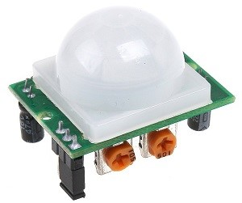
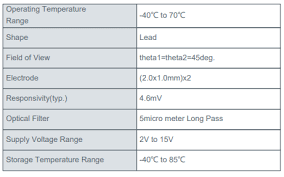
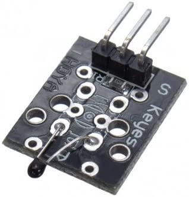

<h1>PIR Motion Sensor</h1>
<p1>
Los sensores PIR le permiten detectar movimiento, casi siempre se usan para detectar si un humano se ha movido dentro o fuera del alcance de los sensores. Son pequeños, económicos, de bajo consumo, fáciles de usar y no se desgastan. Por esa razón, se encuentran comúnmente en electrodomésticos y aparatos que se usan en los hogares o negocios. A menudo se los conoce como sensores PIR, "infrarrojos pasivos", "piroeléctricos" o "de movimiento IR".

Los PIR están hechos básicamente de un  sensor piroeléctrico  (que puedes ver a continuación como una lata de metal redonda con un cristal rectangular en el centro), que puede detectar niveles de radiación infrarroja. Todo emite algo de radiación de bajo nivel, y cuanto más caliente está algo, más radiación se emite. El sensor en un detector de movimiento en realidad está dividido en dos mitades. La razón de esto es que buscamos detectar movimiento (cambio), no niveles de IR promedio. Las dos mitades están cableadas de manera que se anulan entre sí. Si una mitad ve más o menos radiación IR que la otra, la salida oscilará hacia arriba o hacia abajo.
</p1>  

<h1>Analog Temperature Sensor (NTC)</h1>
<p1>
      Un termistor NTC es un sensor de temperatura que utiliza las propiedades de resistencia de los compuestos de cerámica/metal para medir la temperatura.
Los termistores NTC son resistencias dependientes de la temperatura que emplean cerámicas semiconductoras especiales con un coeficiente de temperatura negativo (NTC). Tienen una alta resistencia a temperatura ambiente, y cuando están energizados, generan calor por sí mismos y la resistencia disminuye a medida que aumenta su temperatura. Con esta propiedad, se utilizan como dispositivos de protección de corriente para dispositivos eléctricos y electrónicos que limitan de manera fácil y efectiva las corrientes anormales, incluida una corriente de irrupción en el momento del encendido. Los termistores NTC utilizados como dispositivos de protección de corriente también se denominan termistores de potencia.

Se puede utilizar una resistencia fija o un termistor NTC para limitar las corrientes de irrupción.
Sin embargo, una resistencia fija siempre provoca una pérdida de potencia y una disminución del rendimiento. Un termistor NTC limita una corriente de irrupción con su alta resistencia inicial, y luego su temperatura aumenta debido a la activación y su resistencia cae a un pequeño porcentaje de su nivel a temperatura ambiente, logrando así una pérdida de potencia que es menor que cuando se usa una resistencia fija. usó. En otras palabras, el efecto de limitar las corrientes de irrupción obtenidas mediante el uso de un termistor NTC es mayor que el obtenido mediante el uso de una resistencia fija con pérdidas de potencia iniciales comparables.
   </p1>

